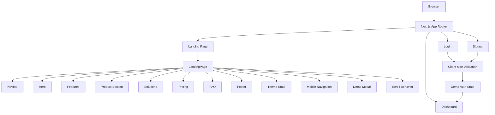

# NOVA — AI Productivity Platform

> A premium AI productivity SaaS concept designed to feel real, modern, and conversion-focused while staying firmly in the frontend prototype space.

[](https://nextjs.org/)
[](https://react.dev/)
[](https://www.typescriptlang.org/)
[](https://tailwindcss.com/)
[](https://motion.dev/)
[](https://vercel.com/)

---

## 🌐 Live Demo

**[View NOVA Live →](https://nova-ai-productivity-chi.vercel.app/)**

---

## ✨ Overview

NOVA is a product-oriented frontend concept for an AI productivity platform. It is designed around the idea that modern teams need cleaner visibility into priorities, faster execution of repeated work, and a more structured way to manage momentum across projects.

The experience blends marketing-page polish with product-dashboard realism. It includes a premium hero, feature storytelling, KPI blocks, pricing, FAQ, and a dashboard-like interface that makes the SaaS idea feel tangible without claiming production infrastructure or real backend systems.

The implementation is intentionally a **frontend prototype**. It does not include a production backend, database layer, real authentication provider, or live AI service integration.

## 🎯 Project Goals

NOVA was built to test and present a strong frontend product direction rather than a full platform implementation. The key goals were:

* Create a premium SaaS-like visual identity without overcomplicating the UX
* Keep the experience responsive across desktop, tablet, and mobile layouts
* Build reusable React components with a clear layout structure
* Support polished interactions with subtle motion and visual feedback
* Maintain strong readability in both light and dark themes
* Present a believable AI productivity brand through product storytelling and dashboard visuals
* Keep the code organized, maintainable, and suitable for frontend review and iteration

---

## 🚀 Features

### Landing Experience

* Responsive sticky navigation
* Desktop and mobile navigation menu
* Smooth section navigation
* Animated loading experience
* Premium hero section
* Product dashboard visualizations
* Trusted-by brand section
* Feature storytelling
* Product/workspace showcase
* How It Works section
* Productivity statistics
* Solutions and use-case sections
* Testimonials presentation
* Pricing plans
* Monthly/annual pricing toggle
* FAQ accordion
* Final CTA section
* Newsletter form with frontend validation
* Back-to-top interaction

### UI & Interaction

* Light/dark theme toggle
* Theme persistence using browser `localStorage`
* Demo product modal
* Responsive mobile navigation
* Interactive FAQ accordion
* Pricing state management
* Smooth scrolling behavior
* Framer Motion animations
* Reduced-motion support
* Responsive card and grid layouts

### Authentication Prototype

The project includes frontend-only authentication flows:

* Login page
* Signup page
* Form validation
* Password visibility toggle
* Password confirmation validation
* Terms checkbox
* Loading states
* Demo authentication state
* Dashboard redirect

These flows are intentionally designed as **frontend prototypes** and are not connected to a production authentication service.

---

## 🧱 Frontend Architecture



The application uses the **Next.js App Router** with a component-driven architecture.

The landing page is assembled from reusable sections, while shared content is centralized in `data/content.ts`.

Client-side interaction is used only where required for features such as:

* Theme switching
* Mobile navigation
* FAQ state
* Pricing toggle
* Modal state
* Form validation
* Demo authentication
* Navigation behavior

There is currently no backend API, database, or production authentication provider.

---

## 📁 Project Structure

```text
nova-ai-productivity/
│
├── app/
│   ├── dashboard/
│   │   └── page.tsx
│   ├── login/
│   │   └── page.tsx
│   ├── signup/
│   │   └── page.tsx
│   ├── globals.css
│   ├── layout.tsx
│   └── page.tsx
│
├── components/
│   ├── AuthShell.tsx
│   ├── BackToTop.tsx
│   ├── DemoModal.tsx
│   ├── FAQ.tsx
│   ├── FeatureCard.tsx
│   ├── Features.tsx
│   ├── FinalCTA.tsx
│   ├── Footer.tsx
│   ├── Hero.tsx
│   ├── HowItWorks.tsx
│   ├── LandingPage.tsx
│   ├── LoadingScreen.tsx
│   ├── Navbar.tsx
│   ├── Pricing.tsx
│   ├── ProductSection.tsx
│   ├── Solutions.tsx
│   ├── Statistics.tsx
│   ├── Testimonials.tsx
│   ├── ThemeToggleButton.tsx
│   └── TrustedBy.tsx
│
├── data/
│   └── content.ts
│
├── public/
│
├── .gitignore
├── eslint.config.mjs
├── next.config.ts
├── package.json
├── package-lock.json
├── postcss.config.mjs
├── tsconfig.json
├── next-env.d.ts
└── README.md
```

---

## 🧩 Technology Stack

| Technology        | Purpose                              |
| ----------------- | ------------------------------------ |
| **Next.js**       | Application framework and App Router |
| **React**         | Component-based UI development       |
| **TypeScript**    | Type-safe application development    |
| **Tailwind CSS**  | Responsive styling and design system |
| **Framer Motion** | Animations and micro-interactions    |
| **Lucide React**  | Consistent icon system               |
| **next/font**     | Optimized font loading               |
| **Vercel**        | Deployment and hosting               |

---

## ⚙️ Getting Started

### Prerequisites

Make sure you have:

* Node.js installed
* npm installed
* Git installed

### Installation

Clone the repository:

```bash
git clone <your-repository-url>
```

Navigate into the project:

```bash
cd nova-ai-productivity
```

Install dependencies:

```bash
npm install
```

Start the development server:

```bash
npm run dev
```

Open:

```text
http://localhost:3000
```

---

## 🏗️ Production Build

To verify the production build:

```bash
npm run build
```

Run the production server:

```bash
npm start
```

Run ESLint:

```bash
npm run lint
```

---

## 🎨 Design System & UX

NOVA follows a premium SaaS design direction built around a dark-first visual language.

### Visual Principles

* Violet and indigo accent colors
* Layered gradients
* Glassmorphism-inspired surfaces
* Strong visual hierarchy
* Consistent spacing
* Modern typography
* Rounded interface elements
* Subtle borders and translucent surfaces
* Responsive layouts
* Light and dark theme support

The interface intentionally balances visual polish with readability instead of relying on excessive decoration.

---

## 📱 Responsive Design

The application is designed to adapt across:

* Desktop
* Laptop
* Tablet
* Mobile

Responsive behavior includes:

* Mobile hamburger navigation
* Responsive grids
* Flexible content widths
* Adaptive typography
* Mobile-friendly spacing
* Stacked content layouts
* Responsive CTA sections
* Mobile section navigation

The navigation system uses shared navigation behavior so desktop and mobile links remain consistent.

---

## ♿ Accessibility

Accessibility and usability are considered throughout the interface.

Implemented patterns include:

* Semantic HTML structure
* Proper form labels
* Accessible navigation controls
* `aria-label` for non-obvious controls
* `aria-expanded` for expandable UI
* Keyboard-friendly interactive elements
* Visible focus states
* Theme-aware contrast
* Reduced-motion support
* Responsive layouts

Animations respect the user's `prefers-reduced-motion` preference where applicable.

---

## 🧪 Testing & Validation

The project can be validated using the standard Next.js production build:

```bash
npm run build
```

This verifies that the application compiles successfully and that the defined routes can be generated correctly.

Key routes include:

```text
/
 /login
 /signup
 /dashboard
```

Interactive areas such as navigation, FAQ, pricing, theme switching, modal behavior, and authentication prototypes are implemented on the frontend.

---

## 🔐 Prototype Scope

NOVA currently focuses on **frontend engineering and product experience**.

### Implemented

* Frontend UI
* Responsive layouts
* Navigation
* Theme management
* Form validation
* Loading states
* Demo authentication flow
* Dashboard route
* Client-side interactions
* Product presentation

### Not Implemented

* Production authentication
* Backend APIs
* Database persistence
* Real user accounts
* Production AI model integration
* Server-side user management
* External business APIs

The login and signup pages are therefore best understood as **interactive frontend prototypes** rather than production authentication systems.

---

## 🤖 AI-Assisted Development

AI tools were used selectively as a design and implementation accelerator, mainly for UI iteration, component cleanup, and problem solving during the refinement process.

They helped with:

* Design direction and layout ideation
* Component planning and structure improvements
* Theme and contrast tuning
* Responsive styling adjustments
* Accessibility refinement
* Bug analysis and refactoring suggestions

The final product was still reviewed, adapted, and validated directly in the actual project codebase rather than copied blindly. The implementation decisions were grounded in the real frontend structure and user experience goals of the site.

---

## 🧠 Engineering Notes

### Design Decisions

The design direction was to make NOVA feel like a premium AI SaaS product without becoming visually noisy.

The interface uses:

* Dark-first styling
* Violet/indigo accents
* Layered gradients
* Glass-like surfaces
* Strong typography hierarchy
* Structured spacing
* Conversion-focused CTAs

The result is intended to communicate a modern, credible SaaS product experience.

### Technology Choices

Next.js and TypeScript provide the application structure and type-safe development environment.

Tailwind CSS provides the responsive styling system, while Framer Motion handles polished transitions and micro-interactions.

Lucide React provides a consistent icon system.

The frontend-only architecture keeps the prototype lightweight while leaving room for future backend integration.

### Component Architecture

The application separates major product sections into reusable components.

Examples include:

* `Navbar`
* `Hero`
* `Features`
* `ProductSection`
* `HowItWorks`
* `Pricing`
* `FAQ`
* `DemoModal`
* `Footer`
* `ThemeToggleButton`

Content is centralized in:

```text
data/content.ts
```

This helps separate content from presentation and makes future updates easier.

### Challenges

Key implementation challenges included:

* Maintaining visual consistency across themes
* Preserving readability in light mode
* Creating responsive mobile navigation
* Maintaining desktop behavior while improving mobile UX
* Balancing animation with usability
* Structuring reusable components
* Keeping frontend interactions maintainable

These were addressed through theme-aware styling, responsive layouts, reusable components, and centralized UI state where appropriate.

---

## 🔮 Future Improvements

Possible future iterations include:

* Real authentication using an authentication provider
* Backend API integration
* Database persistence
* Real AI model integration
* Persistent user workspaces
* Protected dashboard routes
* Real productivity analytics
* Real-time collaboration
* External API integrations
* Automated end-to-end testing
* CI/CD pipeline
* Docker-based deployment
* Expanded dashboard workflows

These are future improvements and are **not currently represented as completed functionality**.

---

## 📊 Evaluation Criteria

| Criteria               | Weight | Project Strength                                                 |
| ---------------------- | -----: | ---------------------------------------------------------------- |
| UI / Visual Design     |     20 | Premium SaaS aesthetic and polished visual system                |
| Responsive Design      |     15 | Desktop, tablet, and mobile layouts                              |
| HTML / CSS Quality     |     15 | Consistent utility styling and theme-aware design                |
| JavaScript / React     |     15 | Interactive state, navigation, validation, and UI behavior       |
| Component Architecture |     10 | Reusable components and centralized content                      |
| Functionality          |     10 | Navigation, FAQ, pricing, modal, auth prototype, dashboard route |
| Accessibility          |      5 | Labels, ARIA states, reduced-motion support, semantic structure  |
| Performance            |      5 | Lightweight frontend architecture and efficient interactions     |
| Code Organization      |      5 | Clear separation of routes, components, and data                 |
| Documentation          |      5 | Detailed setup, architecture, and implementation documentation   |

**Total evaluation weight: 100 points**

---

## 👨‍💻 Author

**Gautam Sagar**

B.Tech Computer Science Engineering student and frontend/full-stack developer focused on building modern web applications and polished digital products.

**Email:** [email-gateaspirant8650@gmail.com](mailto:email-gateaspirant8650@gmail.com)

---

## 🌐 Project Links

* **Live Demo:** https://nova-ai-productivity-chi.vercel.app/
* **Author:** Gautam Sagar
* **Repository:** Add your GitHub repository URL here

---

## 📄 License

This project is currently presented as a personal frontend portfolio and project showcase.

License information can be added according to the project's future distribution requirements.

---

## ⭐ Final Note

NOVA demonstrates how a modern SaaS product can be presented through a high-fidelity frontend experience.

The project combines:

**Premium UI + Responsive Design + React Architecture + Interactive UX + Accessibility + Modern Frontend Engineering**

while maintaining a clear distinction between frontend prototype functionality and production backend capabilities.
