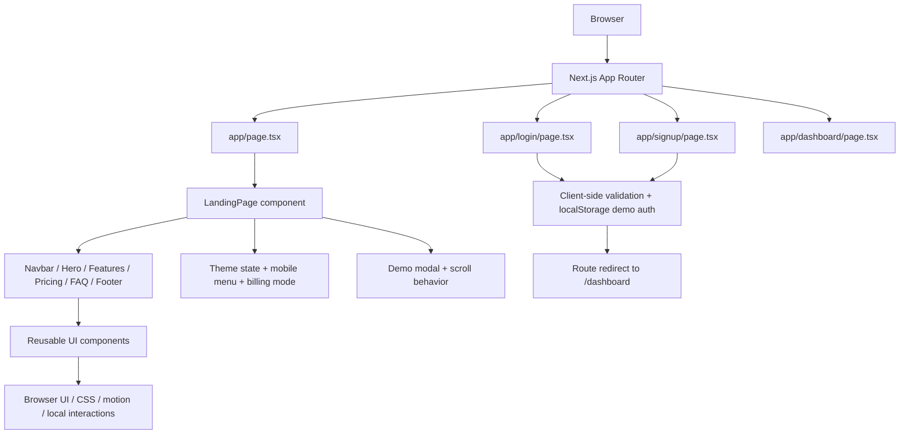

# NOVA — AI Productivity Platform

NOVA is a premium frontend concept for an AI-powered productivity platform designed to help teams coordinate work, automate repetitive tasks, and stay aligned through a polished SaaS-style experience.

[](https://nextjs.org/)
[](https://www.typescriptlang.org/)
[](https://tailwindcss.com/)
[](https://www.framer.com/motion/)

| | |
| --- | --- |
| Project Type | Frontend SaaS landing page + prototype UI |
| Framework | Next.js App Router |
| Language | TypeScript |
| Styling | Tailwind CSS |
| Animation | Framer Motion |
| Icons | Lucide React |

## ✨ Overview

NOVA presents a product concept for a modern AI productivity workspace. The project focuses on the marketing and product experience of a SaaS brand: a strong hero section, feature storytelling, dashboard-like visuals, pricing, FAQ, and conversion-focused call-to-action flows.

This repository is a frontend implementation rather than a production backend system. It demonstrates how a polished productivity product could look and behave in the browser, with interactive UX patterns such as dark/light mode, responsive navigation, modal previews, and demo-only authentication flows.

## 🎯 Project Goals

The project is centered on a high-end frontend experience for a SaaS product concept. The main engineering goals are:

- Build a modern SaaS-style landing page without introducing unnecessary complexity
- Keep the experience responsive across desktop, tablet, and mobile layouts
- Use reusable React components and data-driven content sections
- Support polished interactions with subtle motion and motion-safe behavior
- Implement accessible UI patterns for navigation, modals, forms, and accordions
- Provide strong light and dark theme contrast with consistent visual hierarchy
- Keep the implementation maintainable and performant for a frontend showcase

## 🚀 Features

The current implementation includes the following capabilities and UI sections:

- Responsive sticky navigation with desktop and mobile menu states
- Animated premium loading overlay on initial page load
- Hero section with product messaging and product-visual dashboard mockup
- Trusted-by brand strip and supporting product narrative
- Feature grid covering AI task automation, planning, collaboration, analytics, search, and integrations
- Product/workspace visualization section with workflow and dashboard-style content
- Step-by-step “How it works” experience
- Productivity statistics and KPI-style visual cards
- Solutions/use-case breakdown for startups, engineering teams, agencies, and enterprise
- Customer testimonials carousel-like presentation in a static card layout
- Pricing section with monthly/annual billing toggle
- FAQ accordion interaction
- Final CTA section and newsletter signup form with front-end validation
- Dark/light theme toggle using `localStorage` state
- Demo modal for product preview
- Back-to-top interaction
- Frontend-only login page with validation, password visibility toggle, loading state, and redirect
- Frontend-only signup page with validation, password matching, terms checkbox, loading state, and redirect
- Dashboard route acting as the post-auth demo destination
- Reduced-motion handling via media queries for a more accessibility-aware experience

## 🧱 System / Frontend Architecture



The application is built with the Next.js App Router and uses a component-driven frontend structure. The landing page is composed of reusable sections and shared design primitives, with content sourced from `data/content.ts` and rendered through structured React components.

The project uses server-rendered App Router pages and client-side interactivity where needed. The login and signup flows are intentionally frontend-only prototypes: they validate form input, simulate loading, and redirect within the browser. There is no backend API, database, or real authentication provider in this codebase.

Theme state is persisted through the browser’s `localStorage`, and the UI responds to user preference and manual toggling. UI behaviors such as the mobile menu, FAQ accordion, pricing toggle, and modal interactions are implemented entirely in the browser with React and Framer Motion.

## 📁 Project Structure

```text
nova-ai-productivity/
├── app/
│   ├── dashboard/
│   │   └── page.tsx
│   ├── globals.css
│   ├── layout.tsx
│   ├── login/
│   │   └── page.tsx
│   ├── page.tsx
│   └── signup/
│       └── page.tsx
├── components/
│   ├── AuthShell.tsx
│   ├── BackToTop.tsx
│   ├── DemoModal.tsx
│   ├── FAQ.tsx
│   ├── FeatureCard.tsx
│   ├── Features.tsx
│   ├── FinalCTA.tsx
│   ├── Footer.tsx
│   ├── Hero.tsx
│   ├── HowItWorks.tsx
│   ├── LandingPage.tsx
│   ├── LoadingScreen.tsx
│   ├── Navbar.tsx
│   ├── Pricing.tsx
│   ├── ProductSection.tsx
│   ├── Solutions.tsx
│   ├── Statistics.tsx
│   ├── Testimonials.tsx
│   ├── ThemeToggleButton.tsx
│   └── TrustedBy.tsx
├── data/
│   └── content.ts
├── public/
├── .gitignore
├── eslint.config.mjs
├── next.config.ts
├── package-lock.json
├── package.json
├── postcss.config.mjs
├── tsconfig.json
├── README.md
└── next-env.d.ts
```

## 🧩 Technology Stack

| Area | Implementation |
| --- | --- |
| Runtime | Next.js 16 |
| UI library | React 19 |
| Language | TypeScript |
| Styling | Tailwind CSS |
| Animation | Framer Motion |
| Icons | Lucide React |
| Font loading | Next.js `next/font` with Geist |

## ⚙️ Setup and Local Development

```bash
npm install
npm run dev
```

Then open:

```text
http://localhost:3000
```

For a production build check:

```bash
npm run build
```

The project also includes the standard ESLint script in `package.json`:

```bash
npm run lint
```

## 🎨 Design and UX Decisions

The frontend is intentionally built as a premium SaaS concept with a dark-first aesthetic, layered gradients, glassmorphism-inspired surfaces, and structured whitespace. The experience balances product storytelling with conversion-focused actions while preserving a clear information hierarchy.

Key design choices in the current codebase include:

- Premium visual language built around violet/indigo accents and dark surfaces
- Light-mode support with explicit theme-aware contrast tuning
- Glass-like cards and translucent surfaces for a modern SaaS appearance
- Responsive layout behavior for desktop, tablet, and mobile breakpoints
- Soft motion using Framer Motion for hero animation, FAQ expand/collapse, and modal transitions
- Reduced-motion support through the `prefers-reduced-motion` media query

## ♿ Accessibility and Responsiveness

Accessibility is considered throughout the interface:

- Semantic heading structure and labeled form fields
- `aria-label` usage for non-obvious UI controls such as theme toggle and menu toggle
- `aria-expanded` for the FAQ accordion and mobile menu states
- Visible focus states and clear contrast in both light and dark themes
- Responsive behavior for mobile navigation and content stacking
- Motion-safe fallback for users who prefer reduced motion

## 🧪 Testing and Validation

The project is structured for a frontend-only product showcase and is validated through standard Next.js build checks. The current command used for a production validation pass is:

```bash
npm run build
```

This verifies that the app compiles and generates the static pages used by the project, including the landing page, login route, signup route, and dashboard route.

## 🤖 AI Usage Disclosure

NOVA is presented as an AI productivity platform concept. The interface references AI-driven productivity workflows, automation, and insights, but there is no external AI integration in this repository.

This project does not include:

- backend AI model calls
- real authentication services
- database persistence
- production user management
- external API integrations

The “AI” component here is part of the product narrative and UX design rather than a live backend implementation.

## 🔮 Future Improvements

This is a strong frontend foundation, and the codebase is ready for additional product-oriented refinements such as:

- expanding the dashboard into a more complete product workspace prototype
- adding additional routes and interactive product workflows
- integrating real form submission or API mocks for prototype validation
- polishing the design system into a more formal component library
- adding end-to-end testing for navigation, forms, and theme behaviors

## Summary

NOVA is a polished frontend concept for an AI productivity SaaS brand. It emphasizes premium visual design, responsive user experience, interactive product storytelling, and a demo-ready workflow for login, signup, and dashboard experience.

It is best understood as a high-fidelity frontend prototype for a product pitch or design review, rather than a production-ready application with backend infrastructure.
